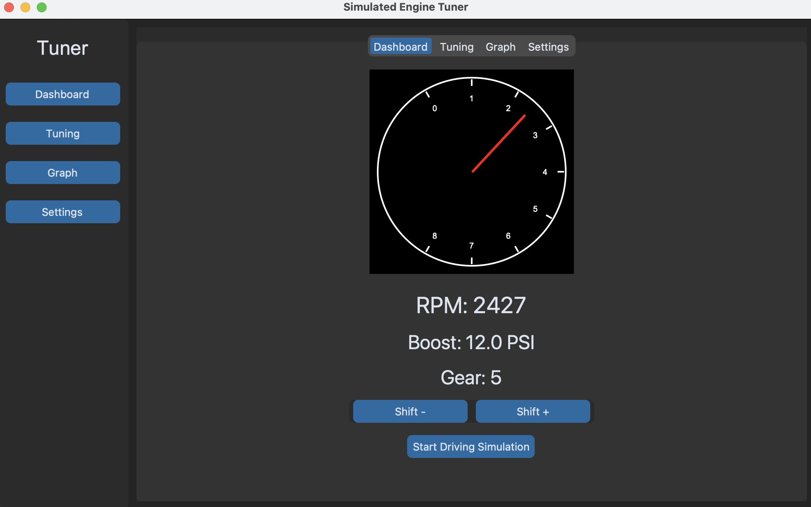

# Simulated Engine Tuner

A modern desktop GUI app that simulates engine behavior for tuning scenarios. Built using Python, `customtkinter`, and `matplotlib`.

## 🚗 Features

- 🔧 Adjustable boost pressure and turbo map presets
- 📈 Real-time RPM gauge with analog needle
- 🕹 Manual and automatic gear simulation with ratios
- ⚠ Knock detection system with warning feedback
- 📁 Save/load tuning profiles (as JSON)
- 🏁 Driving simulation mode (auto-throttle, auto-gear)
- 🎨 Polished UI with dark mode and tabbed navigation

## 🖥 Demo



## 📂 Project Structure
```
engine_tuner/
├── assets/
│ └── engines/
├── ui/
│ ├── tuner_window.py
│ └── rpm_gauge.py
├── main.py
├── engine
│ └── config_loader.py
│ └── engine_registry.py
│ └── simulator.py
└── README.md
```

## 📦 Requirements

- Python 3.8+
- customtkinter
- matplotlib

Install dependencies:

```bash
pip install -r requirements.txt
```

## 🚀 Run the App

python main.py

## 💾 Save & Load Profiles

Profiles are stored in assets/profiles/custom_profile.json. They contain:

Boost level
Gear ratios
Turbo map selection

